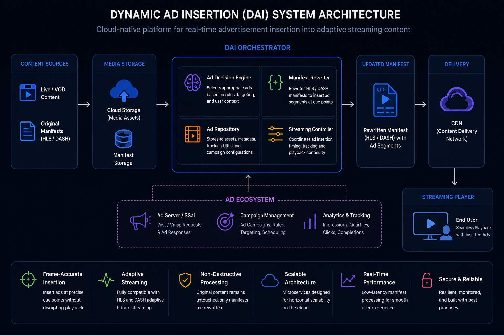

# Dynamic Ad Insertion (DAI) System

A cloud-native Dynamic Ad Insertion platform designed to enable personalized advertisement delivery in adaptive streaming environments through real-time HLS and MPEG-DASH manifest manipulation.

The system provides a scalable architecture for dynamically inserting advertisements into video streams without modifying the original media assets, enabling seamless playback experiences across multiple devices.

---

## Overview

Modern streaming platforms require flexible advertisement delivery mechanisms capable of adapting content based on user context, campaign rules, and playback conditions.

Traditional approaches often require pre-processing and generating multiple versions of the same media asset, resulting in increased storage requirements and reduced flexibility.

This project explores a cloud-native Dynamic Ad Insertion architecture where advertisements are dynamically introduced at the streaming layer through manifest processing.

The platform focuses on:

- Adaptive streaming support (HLS and MPEG-DASH)
- Dynamic manifest generation
- Advertisement decision processing
- Real-time content modification
- Scalable cloud deployment

---

## Architecture Overview

The platform follows a distributed architecture where each component is responsible for a specific processing stage.

High-level workflow:
